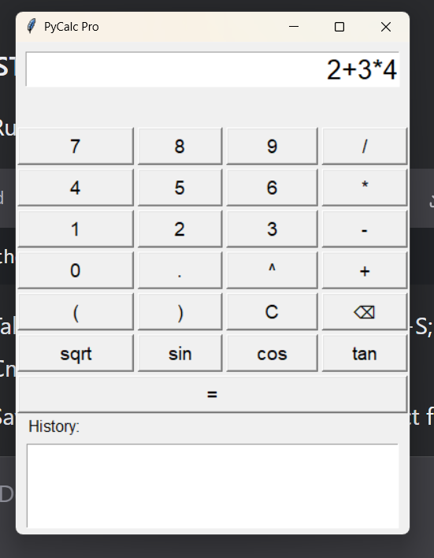

# PyCalc Pro - Advanced Python Calculator



A feature-rich calculator with both CLI and GUI interfaces, built with Python.

## Features
- 🧮 Mathematical operations (+, -, *, /, ^)
- 📚 Calculation history
- 🔢 Scientific functions (sqrt, sin, cos, tan)
- ⌫ Backspace functionality
- 🖥️ Desktop GUI interface
- 💻 Command-line interface

## Installation
```bash
git clone https://github.com/nishant4671/pycalc-pro.git
cd pycalc-pro
```

## Usage
### GUI Version (Recommended)
```bash
python gui_calculator.py
```

### CLI Version
```bash
# Basic calculation
python calculator.py "2+3*4"

# Unit conversion
python calculator.py --convert 10 cm inch
```

## Requirements
- Python 3.6+
- No external dependencies needed!

## Screenshot
